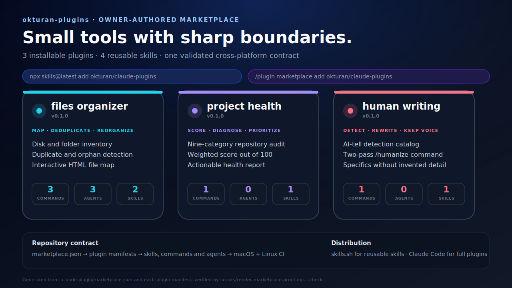

# claude-plugins

[](https://skills.sh/okturan/claude-plugins)

Claude Code plugins and agent skills by [okturan](https://github.com/okturan): file organization, repo health audits, and prose that doesn't read as AI.



The map is generated from the real marketplace and plugin manifests, including their current versions and component counts. CI regenerates the same model on macOS and Linux and fails if the committed proof drifts from the installable repository structure.

## Quickstart (any agent)

Works with any agent that supports skills — Claude Code, Cursor, Codex, and others:

```bash
npx skills@latest add okturan/claude-plugins
```

Pick the skills you want and the agents to install them to. This copies editable `SKILL.md` files into your setup, so you can hack on them.

## Install as a Claude Code plugin

Prefer a managed install that updates when this repo does, and includes the slash commands? Inside Claude Code:

```
/plugin marketplace add okturan/claude-plugins
/plugin install human-writing@okturan-plugins
```

Or from your shell:

```bash
claude plugin marketplace add okturan/claude-plugins
claude plugin install human-writing@okturan-plugins
```

Same pattern for `files-organizer` and `project-health`.

## Skills

- **[human-writing](plugins/human-writing/skills/human-writing/SKILL.md)** — Write outward-facing prose that reads like a person wrote it, and strip AI tells from existing drafts. Ships with a [full catalog of AI tells](plugins/human-writing/skills/human-writing/references/ai-tells.md).
- **[repo-audit](plugins/project-health/skills/repo-audit/SKILL.md)** — Audit any git repo across 9 categories and score it out of 100.
- **[mac-file-patterns](plugins/files-organizer/skills/mac-file-patterns/SKILL.md)** — Classify macOS files, recommend folder hierarchies, and identify cleanup targets.
- **[generate-file-map](plugins/files-organizer/skills/generate-file-map/SKILL.md)** — Produce a self-contained HTML dashboard of file structure and storage usage.

## Plugins

Plugins bundle the skills above with slash commands (Claude Code only).

### human-writing

| Command | What it does |
|---------|-------------|
| `/humanize [text or file]` | Two-pass rewrite: identify AI tells, then rewrite keeping voice and meaning |

The skill also auto-activates when drafting posts, READMEs, announcements, emails, or marketing copy. Based on Wikipedia's Signs of AI writing catalog plus positive craft rules: real specifics, varied rhythm, one rhetorical device per piece, never invent details.

### files-organizer

Find duplicates, analyze folder structure, and generate an HTML dashboard for any directory.

| Command | What it does |
|---------|-------------|
| `/scan [directory]` | File inventory - sizes, types, age |
| `/organize [directory]` | Full analysis with 3 parallel agents |
| `/file-map [output.html]` | Interactive HTML dashboard with cleanup commands |

### project-health

Audit any git repo and score it out of 100 across 9 categories.

| Command | What it does |
|---------|-------------|
| `/project-health` | Full audit across all 9 categories |
| `/project-health --category testing` | Audit a single category |

Categories: Git Health (15), Structure (15), Code Quality (15), Config (10), Database (10), Docs (10), Testing & CI (15), Dependencies (5), Security (5).

## Updating

```bash
npx skills update                                  # skills.sh installs
claude plugin marketplace update okturan-plugins   # Claude Code plugin installs
```

## Verification

Every pull request is checked on both macOS and Linux. CI verifies that marketplace entries and plugin manifests stay in sync, skill and command frontmatter is complete, local documentation links resolve, and the file-organizer shell tools pass syntax, lint, and fixture-based behavior checks. The deep disk scanner is never executed in CI.

## Plugin Structure

Each plugin lives under `plugins/` with its own manifest and components:

```
plugins/plugin-name/
  .claude-plugin/plugin.json   # manifest (name, version, description)
  commands/*.md                # slash commands
  agents/*.md                  # autonomous subagents
  skills/*/SKILL.md            # auto-activating skills
  scripts/                     # helper scripts
  hooks/hooks.json             # event handlers
```

## License

MIT

Security issues involving plugin scripts, trust boundaries, marketplace integrity, or unintended data exposure should be reported privately through [SECURITY.md](SECURITY.md).
