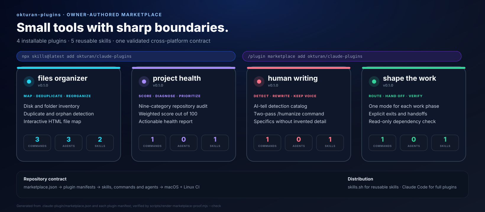

# claude-plugins

Four Claude Code plugins live here. Together they contain five reusable skills, six slash commands, and three file-analysis agents:

- `files-organizer` returns a storage inventory, duplicate candidates, and an HTML file map. It never moves or deletes files on its own.
- `project-health` returns a score out of 100, the evidence behind each deduction, and a concrete next step.
- `human-writing` reports common AI-writing patterns, then rewrites the text without inventing details or changing technical claims.
- `shape-the-work` chooses one work mode for the requested output and reports whether its external dependencies are ready.



The diagram comes from the marketplace and plugin manifests rather than a hand-maintained list. CI rebuilds it on macOS and Linux. A stale version or component count fails the build.

## Install individual skills

The `skills` CLI can copy individual `SKILL.md` files into Claude Code, Cursor, Codex, and other supported agents:

```bash
npx skills@latest add okturan/claude-plugins
```

Choose the skills and target agents at the prompt. The installed files remain editable.

## Install full Claude Code plugins

Claude Code installs each plugin's skills and slash commands together. Inside Claude Code, run:

```
/plugin marketplace add okturan/claude-plugins
/plugin install human-writing@okturan-plugins
```

Or from your shell:

```bash
claude plugin marketplace add okturan/claude-plugins
claude plugin install human-writing@okturan-plugins
```

Replace `human-writing` with `files-organizer`, `project-health`, or `shape-the-work` to install another plugin.

## Skills

- **[shape-the-work](plugins/shape-the-work/skills/shape-the-work/SKILL.md):** Choose ordinary execution, OpenSpec exploration, a Wayfinder decision map, or a Long-Horizon launch brief based on the requested output.
- **[human-writing](plugins/human-writing/skills/human-writing/SKILL.md):** Draft posts, READMEs, announcements, emails, and marketing copy in a plain voice. The accompanying [AI-writing catalog](plugins/human-writing/skills/human-writing/references/ai-tells.md) is used when revising existing text.
- **[repo-audit](plugins/project-health/skills/repo-audit/SKILL.md):** Check a Git repository across nine categories and score it out of 100.
- **[mac-file-patterns](plugins/files-organizer/skills/mac-file-patterns/SKILL.md):** Classify macOS files, review folder structure, and identify cleanup candidates.
- **[generate-file-map](plugins/files-organizer/skills/generate-file-map/SKILL.md):** Write a self-contained HTML report of file structure and storage use.

## Plugins

Plugins bundle the skills above with slash commands (Claude Code only).

### shape-the-work

Choose the mode that owns the requested output. Duration alone does not change the route. The router does not assume a particular product or repository.

| Command | What it does |
|---------|-------------|
| `/shape-work [task]` | Check dependency readiness, select one mode, and report its output and exit condition |

OpenSpec Explore, Wayfinder, and Long-Horizon Prompting remain external dependencies maintained by their upstream projects. The checker distinguishes file presence from operational readiness without changing the machine. See the [plugin README](plugins/shape-the-work/README.md) for sources and setup requirements.

### human-writing

| Command | What it does |
|---------|-------------|
| `/humanize [text or file]` | Report the patterns it found, then rewrite without changing the meaning or voice |

The skill also loads when Claude drafts posts, READMEs, announcements, emails, or marketing copy. It uses Wikipedia's Signs of AI writing as a pattern catalog. When a draft needs details that are not in the source material, it asks for them or leaves a bracketed question instead of making them up.

### files-organizer

Scan a directory, group duplicate candidates, review file placement, and write an HTML report.

| Command | What it does |
|---------|-------------|
| `/scan [directory]` | Disk-usage inventory, including hidden folders and selected system locations |
| `/organize [directory]` | Duplicate, placement, and folder-structure review with three agents |
| `/file-map [output.html]` | Standalone HTML report with file counts, sizes, and suggested commands |

### project-health

Score a Git repository out of 100 across nine documented categories.

| Command | What it does |
|---------|-------------|
| `/project-health` | Run all nine category checks |
| `/project-health --category testing` | Run one category |

Categories: Git Health (15), Structure (15), Code Quality (15), Config (10), Database (10), Docs (10), Testing & CI (15), Dependencies (5), Security (5).

## Updating

```bash
npx skills update                                  # skills.sh installs
claude plugin marketplace update okturan-plugins   # Claude Code plugin installs
```

## Verification

Every pull request is checked on macOS and Linux. CI compares marketplace entries with plugin manifests, requires this README to list every plugin, skill, and command, validates component frontmatter, resolves local documentation links, and tests the bundled shell helpers. It does not run the disk scanner against the CI host.

## Plugin Structure

Each plugin lives under `plugins/` with its own manifest and components:

```
plugins/plugin-name/
  .claude-plugin/plugin.json   # manifest (name, version, description)
  commands/*.md                # slash commands
  agents/*.md                  # autonomous subagents
  skills/*/SKILL.md            # reusable agent skills
  scripts/                     # helper scripts
  hooks/hooks.json             # event handlers
```

## License

MIT

Security issues involving plugin scripts, trust boundaries, marketplace integrity, or unintended data exposure should be reported privately through [SECURITY.md](SECURITY.md).
