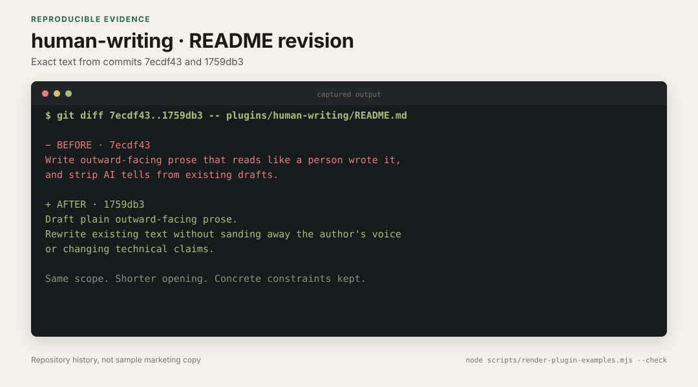

# human-writing

Draft plain outward-facing prose. Rewrite existing text without sanding away the author's voice or changing technical claims.

The plugin has two parts:

- **Skill** (`human-writing`): loads when Claude drafts social posts, blog posts, READMEs, announcements, emails, or marketing copy. It asks for real details, uses plain verbs, and varies sentence rhythm.
- **Command** (`/humanize`): reports the AI-writing patterns it found, then rewrites the text while preserving its meaning and voice.

## Usage

```
/humanize path/to/draft.md
/humanize <pasted text>
```

Claude can also load the skill automatically while drafting a post, README, announcement, email, or marketing page.

## Real revision



The text above comes from this plugin's own history. Commit [`1759db3`](https://github.com/okturan/claude-plugins/commit/1759db3) replaced a generic opening with two shorter sentences while keeping the scope and constraints. The [capture provenance](../../docs/examples/README.md#human-writing) includes the exact `git diff` command.

## Limits

The skill does not invent specifics. If the source material lacks a number, event, or limitation, it asks for that information. Otherwise, it leaves a bracketed question. It also leaves quoted material and technical claims alone.

## Sources and prior art

The revision catalog draws from these sources:

- [Wikipedia: Signs of AI writing](https://en.wikipedia.org/wiki/Wikipedia:Signs_of_AI_writing)
- [The Field Guide to AI Slop](https://www.ignorance.ai/p/the-field-guide-to-ai-slop)

[blader/humanizer](https://github.com/blader/humanizer) uses the same Wikipedia catalog and focuses on cleaning up existing text. This plugin also covers first drafts and asks for source details before writing.
