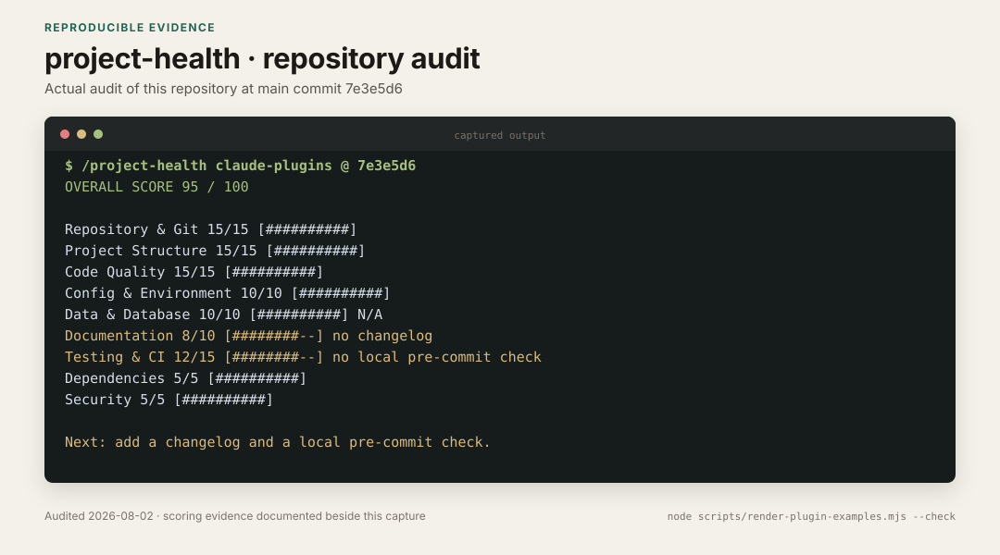

# project-health

A Claude Code plugin for scoring a Git repository against a documented checklist.

The checklist has nine categories and a total of 100 points. Most checks apply to any Git repository. Code-specific checks recognize Python, JavaScript, TypeScript, Go, Rust, and Java.

## Commands

### `/project-health`

Runs all nine categories in parallel. The report shows each score, the evidence behind deductions, and a concrete next step for every suggested change.

### `/project-health --category <name>`

Audit a single category. Valid names: `git`, `structure`, `code`, `config`, `data`, `docs`, `testing`, `deps`, `security`.

## Categories

| Category | Max Points | What it checks |
|----------|-----------|----------------|
| Repository & Git | 15 | Remotes, clean tree, commit messages, large blobs, branching |
| Project Structure | 15 | Separation of concerns, naming, clutter, config/data/code split |
| Code Quality | 15 | God files, style consistency, docs, dead code, type annotations |
| Config & Environment | 10 | .gitignore, credentials, .env.example, packaging config |
| Data & Database | 10 | Stale DBs, migrations, data file organization |
| Documentation | 10 | README, LICENSE, CHANGELOG, AI-aware docs, code docs |
| Testing & CI | 15 | Tests, CI/CD, linting, pre-commit hooks |
| Dependencies | 5 | Pinned versions, unused deps, runtime version, lock files |
| Security | 5 | Hardcoded secrets, sensitive file permissions, auth scopes |

## Audited example



This records an audit of this repository at [`7e3e5d6`](https://github.com/okturan/claude-plugins/commit/7e3e5d6). The missing changelog cost two points. The lack of a local pre-commit check cost three. The [capture provenance](../../docs/examples/README.md#project-health) records the evidence for every category. It also keeps the dated result separate from current-state claims.

## Components

```
project-health/
  .claude-plugin/plugin.json
  commands/
    project-health.md    # /project-health command
  skills/
    repo-audit/          # 9-category audit methodology (Claude-only)
      SKILL.md
```

## Requirements

- Any git repository
- Claude Code with plugin support

## License

MIT
