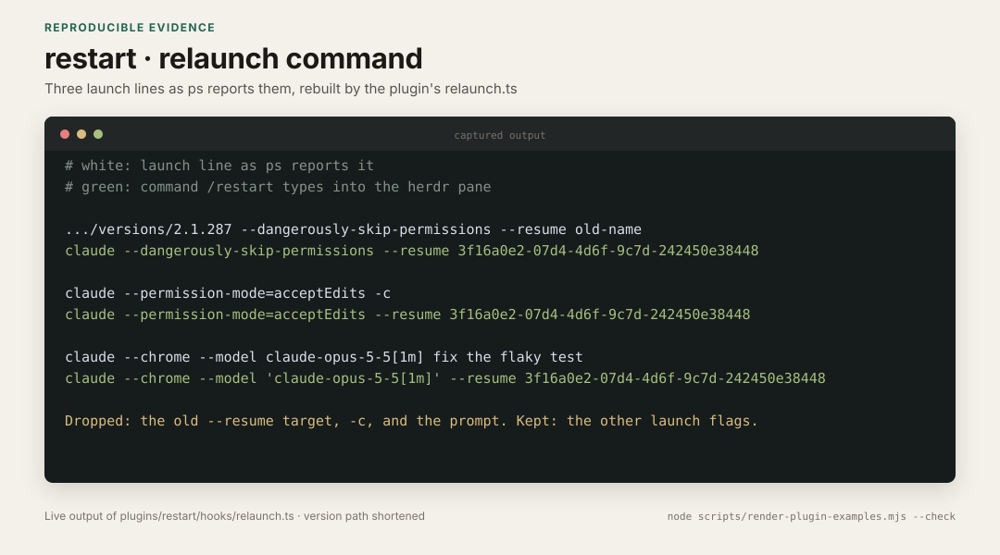

# restart

Adds `/restart`. It closes the current session and opens it again on the newest Claude Code installed on the machine. The conversation and the launch flags carry over.

Use it after Claude Code updates itself in the background. The running session stays on the old version until you restart it, and `/restart` saves you from retyping the flags and the session id.

## Requirements

- [herdr](https://herdr.dev). After Claude Code exits, something has to type the new command into the same terminal pane. herdr can do that from another process with `herdr pane run`. A plain terminal cannot. Outside herdr, `/restart` does not exit. It prints the command for you to run.
- Claude Code 2.1.287 or later. The plugin is a mod, a set of function hooks, and older versions do not load mods.
- macOS or Linux with `/bin/sh` and `perl`. The helper uses perl to detach from the session.

## Install

```text
/plugin marketplace add okturan/claude-plugins
/plugin install restart@okturan-plugins
```

## Use

```text
/restart
```

It shows the running version, the installed version, and the command it will run. About a second later the session ends, the same pane runs the command, and the session opens again.

## How it works

1. It finds the session's own `claude` process and reads the flags it was started with.
2. It keeps flags such as `--dangerously-skip-permissions`, `--permission-mode`, `--model` and `--chrome`.
3. It drops flags that pick a conversation or run a single prompt: `--resume`, `--continue`, `--session-id`, `--print`, and any positional prompt.
4. It builds `claude <flags> --resume <session id>`. Plain `claude` resolves to the newest installed version, which is how the update gets picked up.
5. It starts a detached helper. The helper sends the session SIGTERM, which ends it the same way closing the terminal does. A mod cannot end the session with `/exit`.
6. Once the session is gone, the helper types the command into the pane with `herdr pane run $HERDR_PANE_ID`.

## Relaunch command



The capture runs the plugin's own `relaunch.ts` on three sample launch lines. CI fails if the output changes. See the [provenance notes](../../docs/examples/README.md#restart).

## Limits

- Only launch flags carry over. If you switched the permission mode during the session with shift+tab, the new session starts in the mode from the original flags.
- There is no exit confirmation. A running background task is stopped, as it would be if you closed the terminal.
- Effort level does not carry over. The new session uses the saved default effort for its model.
- If the session is still running after a minute, the helper gives up and nothing restarts.
- The flags come from `ps`, which drops the original quoting. A flag value that contains spaces, such as a quoted system prompt, does not survive.
